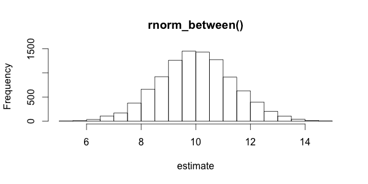
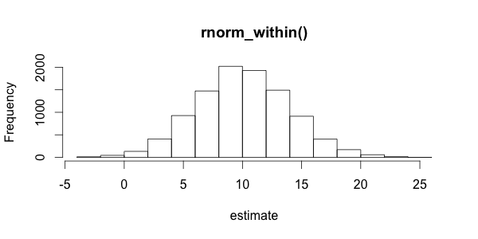
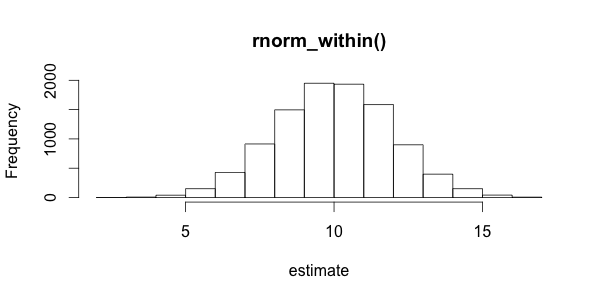
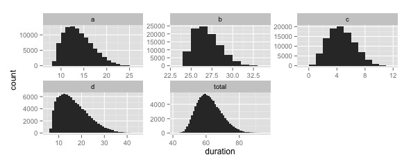

# randr

Provides convenience functions for generating random numbers. The main intent is to utilize expert estimations of key distribution characteristics to generate random numbers for monte carlo simulation.

The function names all begin with distribution function from `base` or `VGAM` and end with an extension related to the function's operation, as `rnorm_within()` or `runif_digits()`. Currently supported are `rnorm`, `runif`, `rtriangle` and `rbeta`.

`*_within()` generates within the given range with a `confidence_level` tolerance interval with `lower` and `upper` as the $(1 - \mathrm{confidence\_level})/2$ and $(1 + \mathrm{confidence\_level})/2$ limits, respectively.

`*_between()` generates random numbers between the given range, inclusive. $X \in \left[\mathrm{lower}, \mathrm{upper}\right]$.

`runif_digits` generates a uniformly-distributed integer with length equal to the given number of digits. 

## Installation

```{r}
install.packages("VGAM")
devtools::install_github("tomhopper/numbr")
devtools::install_github("tomhopper/randr")
```

## Examples

### Generating normal distributions from max/min estimates

```{r}
between <- rnorm_between(n = 10000, lower = 5, upper = 15)
within <- rnorm_within(n = 10000, lower = 5, upper = 15, confidence_level = 0.8)
within2 <- rnorm_within(n = 10000, lower = 5, upper = 15, confidence_level = 0.99)

hist(between, main = "rnorm_between()", xlab = "estimate")
hist(within, main = "rnorm_within()", xlab = "estimate")
hist(within2, main = "rnorm_within()", xlab = "estimate")
```





### Generating PINs

```{r}
runif_digits(5, 4)
```

```
[1] 4803 3681 5528 7581 1144
```

### Project planning
```{r}
library(lubridate)
df <- data.frame(a = rbeta_within(100000, 12, 10, 20),
                 b = rbeta_within(100000, 26, 25, 30),
                 c = rbeta_within(100000, 4, 2, 8),
                 d = rbeta_within(100000, 12, 9, 30))
df$total <- apply(df, MARGIN = 1, sum)
mean_total_dur <- mean(df$total)
safe_total_dur <- quantile(df$total, probs = c( 0.95))

delivery_date <- now() + days(as.integer(safe_total_dur))
sums <- apply(X = df, MARGIN = 2, FUN = mean)
sprintf("Planned duration for %s: %.0f days.", letters[1:5], sums)
sprintf("Buffer length: %.0f days", safe_total_dur - mean_total_dur)
sprintf("Delivery date: %s", format(delivery_date, "%Y-%m-%d"))

library(tidyr)
library(ggplot2)
df2 <- gather(data = df, key = task, value = duration)
ggplot(df2) +
  geom_histogram(aes(x = duration), binwidth = 1) +
  facet_wrap(~ task, scales = "free")

```

```
[1] "Planned duration for a: 14 days." "Planned duration for b: 27 days." "Planned duration for c: 5 days." 
[4] "Planned duration for d: 17 days." "Planned duration for e: 62 days."
[1] "Buffer length: 13 days"
[1] "Delivery date: 2015-10-19"
```

